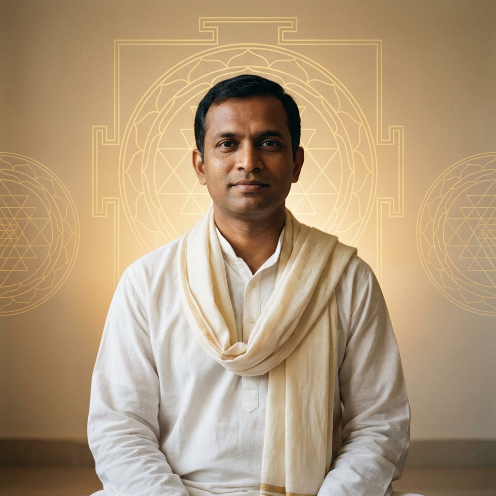

# Acharya Prashant AI Chatbot

A beautiful, animated website featuring an AI chatbot powered by RAG (Retrieval Augmented Generation), inspired by the design aesthetics of landonorris.com.



## Features

- 🎨 **Stunning Design**: Animated landing page with sacred geometry, parallax effects, and smooth transitions
- 💬 **AI Chatbot**: Conversational AI trained on Acharya Prashant's teachings
- 📚 **RAG-Powered**: Retrieves context from vector database before responding
- 💾 **Chat History**: Persistent conversations stored in SQLite
- 📱 **Responsive**: Works on desktop and mobile devices

## Tech Stack

- **Backend**: Flask, Python
- **Database**: SQLite (chat history), ChromaDB (vector store)
- **AI**: OpenRouter API
- **Frontend**: Vanilla HTML/CSS/JS with custom animations

## Quick Start

1. Clone the repository:
```bash
git clone https://github.com/YOUR_USERNAME/AP_Project_2026.git
cd AP_Project_2026
```

2. Install dependencies:
```bash
pip install -r requirements.txt
```

3. Set up environment variables:
```bash
# Create .env file with:
OPENROUTER_API_KEY=your_api_key_here
```

4. Run the knowledge base setup (if not already done):
```bash
python fetch_articles.py
python process_artices.py
python load_to_VDB.py
```

5. Start the server:
```bash
python app.py
```

6. Open http://localhost:5000

## Project Structure

```
├── app.py              # Flask server
├── main.py             # RAG query logic
├── static/
│   ├── css/style.css   # Design system
│   ├── js/             # Frontend logic
│   └── images/         # Generated images
├── templates/
│   ├── index.html      # Landing page
│   └── chat.html       # Chat interface
└── my_chroma_db/       # Vector database
```

## Deployment

This app is deployed on Render. See [Render deployment docs](https://render.com/docs/deploy-flask).

## License

For educational purposes only.
